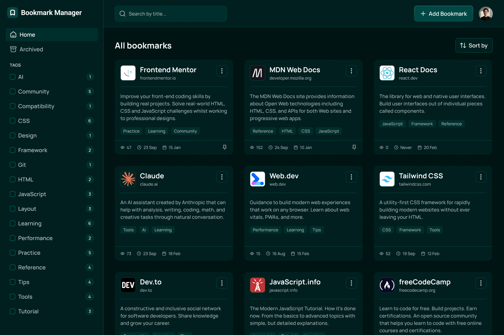

# Bookmark Manager (MERN)

A responsive bookmark manager app built to match the provided design as closely as possible. Users can save, organize, search, and manage bookmarks, with support for light/dark theme and an archived view. This project can be used with local seed data (`data.json`) and can also be extended into a full-stack app with optional authentication.

## Features

Users can:

- Add new bookmarks with a **title**, **description**, **website URL**, and **tags**
- View all bookmarks
- See bookmark details, including:
  - favicon, title, URL, description, tags
  - view count, last visited date, date added
- Search bookmarks by title
- Filter bookmarks by selecting one or multiple tags from the sidebar
- Reset tag filters to view all bookmarks again
- View archived bookmarks
- Archive bookmarks (remove from main view without deleting)
- Pin/unpin bookmarks
- Edit existing bookmarks
- Copy bookmark URLs to the clipboard
- Visit bookmarked websites directly from the app
- Sort bookmarks by **Recently added**, **Recently visited**, or **Most visited**
- Toggle between **light** and **dark** themes
- Get an optimal layout across different screen sizes
- See hover and focus states for interactive elements

## Tech Stack

- Frontend: React
- Backend: Node.js + Express (optional / if enabled in this repo)
- Database: MongoDB (optional / if enabled in this repo)
- Styling: Tailwind CSS (if configured in this repo)

## 📸 Screenshots

### Main Interface


## Getting Started

1. **Clone the repo:**  
   `git clone https://github.com/abdizahir/bookmark.git`
2. **Install and run backend:**  
   ```
   cd server
   npm install
   npm start
   ```
3. **Install and run frontend:**  
   ```
   cd ../client
   npm install
   npm start

Open: http://localhost:3000

- **Email:** test2@test.com
- **Password:** 123456


## 🔗 Links
- Solution URL (GitHub Repository): [Link](https://github.com/abdizahir/bookmark)
- Live Site URL (Deployed App): [Link](https://bookmark-five-dusky.vercel.app/auth) 

## Author
**Abdallah Mohammed**  
- GitHub: https://github.com/abdizahir